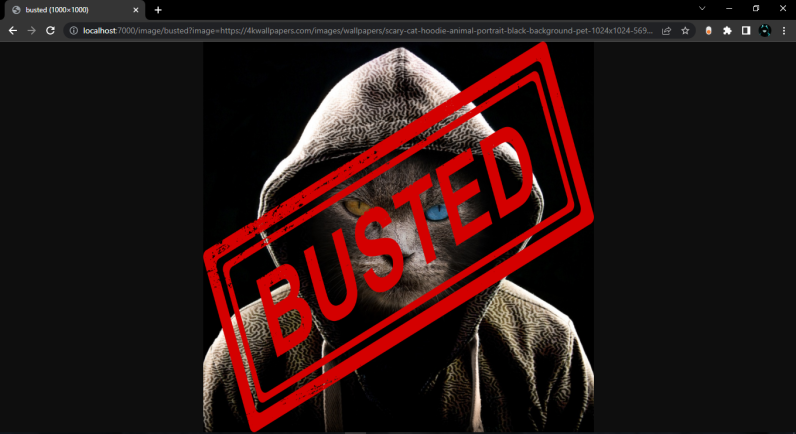

# API 🌐

> **An API by [s3mant](https://github.com/s3mant).**

- Very simple and advanced.
- Auto list endpoints.

## Contributing 🤝

- Contributions, issues and feature requests are welcome!
- Feel free to check **[issues page](https://github.com/Bad-Boy-Codes/Express-API-Template/issues)**.

## Preview:

**Home Page:**

**Image route:**

**Text route:**

